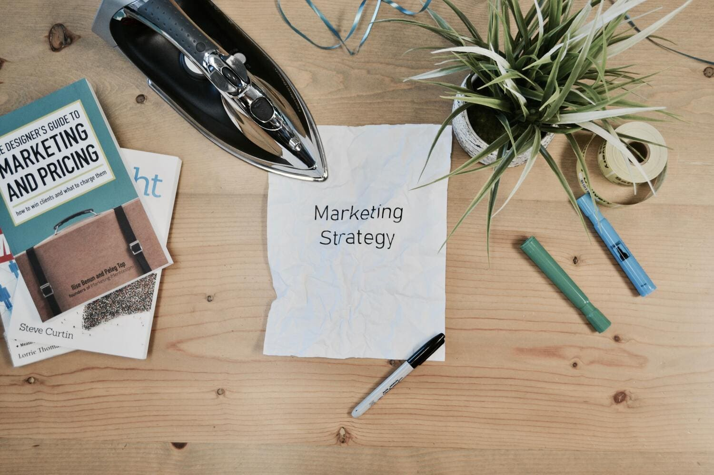

+++
title = "AIDA auf Social Media"
date = "2022-12-16"
draft = false
pinned = false
image = "adem-ay-lqyqm2icicy-unsplash-3-1-.jpg"
description = "Werbung - Eines der wichtigsten Elemente eines Projektes!"
footnotes = "Bild 1 \"Social Media\" [Free Viral Image on Unsplash](https://unsplash.com/photos/lqyqm2ICIcY)\n\nBild 2 \"Marketing Strategy\" [white printing paper with Marketing Strategy text photo – Free Marketing Image on Unsplash](https://unsplash.com/photos/yktK2qaiVHI)"
+++
Als wir uns mit dem Thema Werbung befassten, wussten wir schnell, wie die meisten anderen, dass wir auf verschiedenen Social Media Plattformen Werbung für unser Projekt machen wollen.

Doch welche Plattformen nutzen wir? Da im Moment die meistgenutzten Plattformen Instagram und TikTok sind, beschlossen wir, uns auf diese zu fokussieren. Wir haben also einen Instagram- und einen TikTok-Account erstellt. Auf diesen beiden Plattformen gibt es sehr einfache Möglichkeiten Werbung zu machen. Man kann einerseits Fotos, andererseits Videos hochladen und überall auch eine Webseite verlinken.

Ein Problem, welches sich wie erwartet zeigte war, Reichweite zu bekommen. Dies ist jedoch etwas, mit dem man sich bei einem "realen" Projekt enger befassen müsste. Eine Möglichkeit mehr Reichweite zu bekommen sind zum Beispiel Reposts durch Kunden oder Bekannte. 

Jeodch spielt nicht nur die Reichweite eine Rolle, sondern auch die Art der Werbung. Mithilfe des AIDA-Prinzip werden wir in Zukunft versuchen, unsere Werbung so gut wie möglich zu gestalten. 

Das AIDA-Prinzip ist:

* **A**ttention --> Aufmerksamkeit erregen
* **I**nterest --> Interesse wecken
* **D**esire --> Verlangen auslösen
* **A**ction --> Kauf anstossen

Dies kann man alles in einem Foto oder Video verpacken. Zum Besipiel ein schönes oder lustiges Bild, welches die Aufmerksamkeit der potentiellen Kunden/innen auf sich zieht. Dann ein kurzer aber einprägsamer Schriftzug, um das Interesse zu wecken und einen Beschrieb, durch welchen der Kunde merkt, dass unser Produkt das Perfekte für sie oder ihn ist. Somit wären die ersten drei Buchstaben abgedeckt und mittels eines ansprechenden Preises wird auch der Anstoss zum Kauf möglich.

Mit Hilfe dieser Mittel möchten wir nun versuchen, unsere Werbestrategie zu optimieren und auf Social Media gute und seriöse Werbung zu machen.