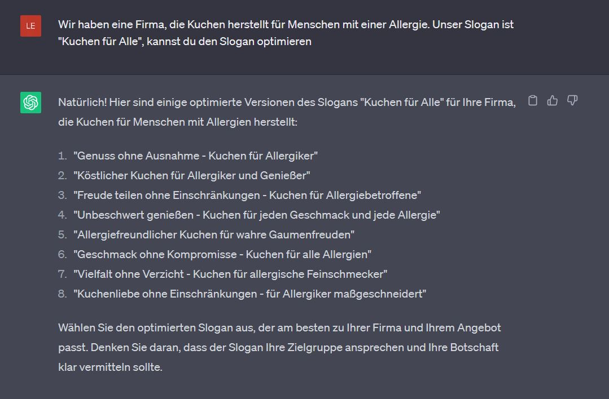

+++
title = "ChatGPT zur Optimierung "
date = "2023-05-31"
draft = false
pinned = false
image = "openai.jpg"
+++
ChatGPT - die neue Technologie, doch wie gut kann eine KI wirklich helfen?

Ich habe versucht, mit ChatGPT einen meiner vorherigen Blogeinträge zu optimieren. Das Resultat war aber leider nicht so wie erhofft. ChatGPT hat kaum etwas geändert ausser ein paar kleine Satzstellungen. Inhaltlich jedoch gar nichts. Eigentlich hätte ich gedacht, dass es ist, weil er nicht über das Thema bescheid weiss. Der Blogeintrag war aber über ein YouTube Video, welches öffentlich im Netz ist, das heisst, kein persöliches Wissen oder eigene Meinung.

Bei der Tagline, hat die KI mehrere gute Vorschläge gebracht. Um eine gute Antwort zu bekommen, habe ich bei der Fragestellung kurz gesagt, was unsere Firma macht und unsere eigentliche Tagline eingegeben. Mit dieser Technik erhielt ich etwa 7 oder 8 verschiedene Vorschläge. 

Meiner Meinung nach kann ChatGPT bei einigen Sachen helfen, jedoch eher bei kürzeren Texten. Will man natürlich nur Informationen, ist es sehr praktisch. Aber wie gesagt würde ich mich bei längeren Texten eher auf eine Optimierung konzentrieren, da man sich immer noch entscheiden kann, ob man die eigene Version oder die der KI verwenden möchte.

Jedoch denke ich, wenn man einen Text von ChatGPT schreiben lässt und diesen dann selber überarbeitet und vielleicht noch eigene Informationen mit einbrignt, kann auch ein gutes Ereignis herauskommen. Die Kombination der KI und uns, ist sicher ein guter Anfang auch auf die Vorbereitung auf die Zukunft, in der die KI einen immer wichtigeren Platz in unserem Leben und unserer Gesellschaft einnehmen wird.