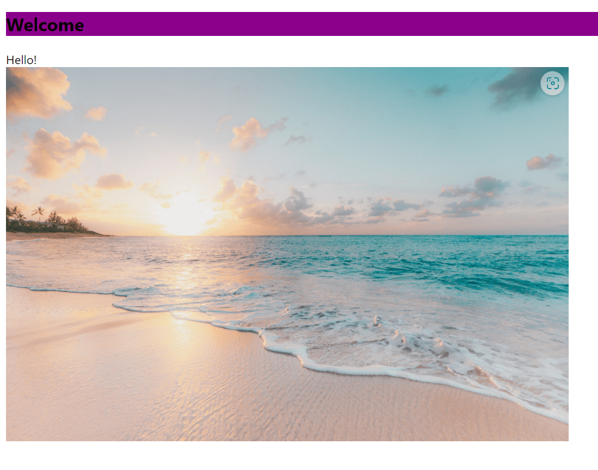

+++
title = "Programmieren mit HTML/CSS"
date = "2022-10-25"
draft = false
pinned = false
image = "html.png"
description = "Die ersten Schritte beim Programmieren mit HTML und CSS"
+++
**HTML und CSS, weniger kompliziert als man denkt!**

In den WEB Lektionen vom 18.10. und 25.10.2022 haben wir mit den Grundlagen der Programme HTML und CSS begonnen. Mit einem Tutorial konnte man selbstständig daran arbeiten und erste Erfahrungen sammeln. 

Zuerst dachte ich, dass es sehr kompliziert und schwierig ist. Als ich jedoch begonnen habe und die ersten Einträge erstellte, merkte ich, dass es teilweise einfacher ist, als man denkt. 

Bis jetzt habe ich mich nur darauf konzentriert, ein grobes Gerüst zu erstellen und dort einen Titel und ein Bild einzufügen. Anschliessend habe ich mit Hilfe von CSS die Schrift- und Bildgrösse sowie Farben bearbeitet. Dies ging relativ gut, mit Hilfe von Herr Baumberger und von Mitschülern. Einige Schwierigkeiten hatte ich, beim verkleinern des Bildes und beim erkennen, welche Eingaben, wie <body>, h2, titel, ich tätigen muss, um das richtige Resultat zu erhalten. Mit etwas Hilfe und dem erneuten nachlesen im Tutorial konnte ich diese Probleme aber lösen. Und konnte somit einige Elemente einer Webseite gestalten. wie body, h2, titel,

Ich denke, je weiter und detailierter ich programmieren möchte, desto komplexer wird es. Dort werde ich wahrscheinlich auf mehrere Probleme stossen. 

Dies wird aber noch etwas dauern aber ich freue mich sehr darauf, mehr zu lernen und somit auch bessere Ergebnisse zu erhalten. Nächste Woche werden wir uns wahrscheinlich mehr auf die Projektarbeit fokussieren aber ich denke, ich werde mir trotzem etwas Zeit nehmen am Programmieren weiter zu arbeiten.