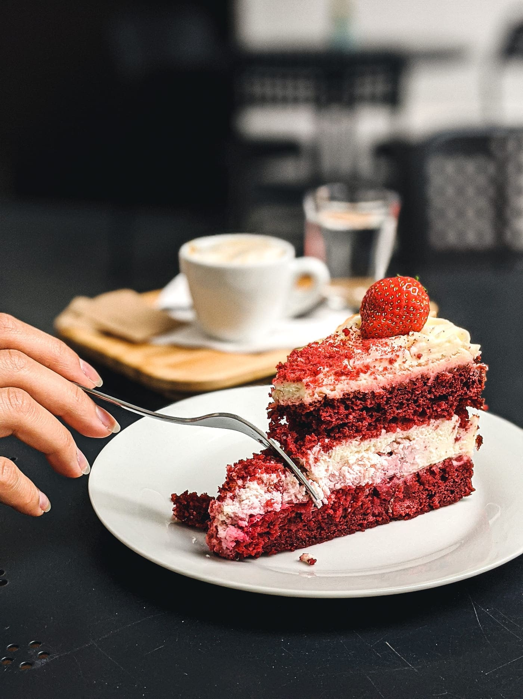

+++
title = "Wer möchte \"Kuchen für alle\"?"
date = "2022-09-13"
draft = false
pinned = false
image = ""
+++
Momentan sind wir an einem sehr wichtigen Schritt unseres Projektes, dass Bestimmen einer Zielgruppe. Dabei stellt sich die Frage "Wer möchte *Kuchen für alle*?" Wir müssen uns überlegen, in welcher Altersgruppe, Lebenssituation und wirtschaftlichen Lage sich unsere Zielgruppe befindet. 

WIr haben uns dazu entschlossen, unser Projekt hauptsächlich über soziale Medien zu vermarkten. Daraus lässt sich schliessen, dass die angesprochenen Personen eher jünger sind. Doch wie finanzieren jüngere Menschen so etwas? Müssen wir unsere Preise nach diesem Kriterium setzen, oder gibt es andere Möglichkeiten? Dies sind Folgefragen, welche sich nun zeigen und welche wir in nächster Zeit bearbeiten müssen.

